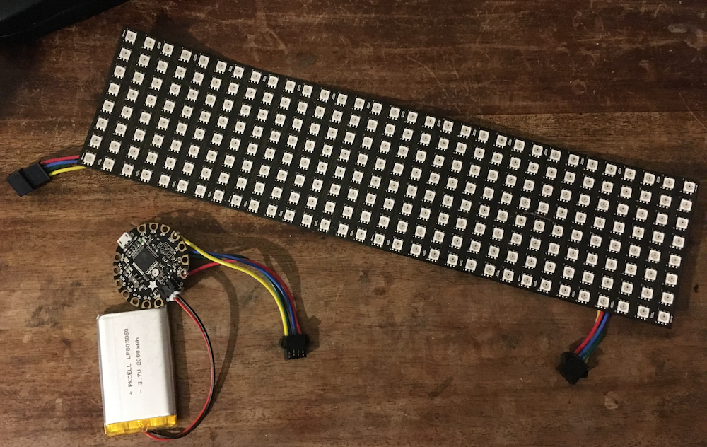

LED Protest Sign Scroller
================================


"Christmas Light" LED signs are now ubiquitous! This is my quick and dirty attempt to make signs out of lightweight semi-flexible, addressable LED matrix boards. For use with Arduino compatible board and WS281x (Neopixel) or APA102 (DotStar) LEDs, and probably easily adaptable to other microcontrollers and LEDs. 

I've built a version mounted on posterboard, and some water-resistant bag-mounted versions encased in vinyl too!

Bill of Materials
------------

* [8x32 WS2812 "Neopixel" LED Matrix](https://www.adafruit.com/product/2294) (or 8x32 APA102 "DotStar" LED Matrix)
* Small Arduino-compatible board of your choice: Arduino Nano, [Flora](https://www.adafruit.com/product/659), [Feather 32u4](https://www.adafruit.com/products/2771), [Metro Mini](https://www.adafruit.com/products/2590), [Trinket Pro](https://www.adafruit.com/products/2000) all work great here.
* Power source: USB Battery Pack or lithium battery.
* Posterboard, wire, solder and soldering iron, tape, glue, etc.
* If using a USB Battery Pack: an old USB cable you don't mind chopping up (you're going to use it for power, not data)
* Optional, but very helpful extra [JST connectors](https://www.adafruit.com/products/1663) (if you want to make everything detachable)

Cost: ~$120 if you buy everything retail, a lot less if you can buy bulk, do your own sourcing, or have some of the parts on hand!

Very basic hardware setup shown below: LED Matrix, a lithium battery, a Flora board, some JST SM connectors.


Software
------------
To keep thing easy here I tried to use as much off the shelf material as possible.

You need to install the Arduino IDE:

* [Arduino IDE](https://www.arduino.cc/en/main/software)

And some Arduino libraries 

* [Adafruit NeoPixel library](https://github.com/adafruit/Adafruit_NeoPixel)
* [Adafruit NeoMatrix library](https://github.com/adafruit/Adafruit_NeoMatrix)

And download the sample sketch `neopixelsign.ino`

(If you're using APA102 LEDs you'll want DotStar variations of the above)

Instructions
------------
These assume you are using WS2812 "Neopixels", but the process should be similar with an APA102 "Dotstar" Matrix and I've included an ino sketch for those as well!

* Open the `neopixelsign.ino` in Arduino IDE
* Install the Adafruit libraries, `Sketch > Include Libraries > Manage Libraries`, or unzip into your `Arduino/libraries` folder ([more instructions how to install Arduino libraries](https://www.arduino.cc/en/Guide/Libraries))

* In Arduino IDE, edit the protest messages in the config area (and colors if desired)

```
// Put your messages here
char* slogans[]= {"NET NEUTRALITY!","OPEN + AFFORDABLE INTERNET","SAVE THE NET","DEFEND INTERNET FREEDOM","#SAVETHENET #NETNEUTRALITY"};

// And your RGB colors here
const uint16_t colors[] = { matrix.Color(255, 0, 0), matrix.Color(0, 255, 0), matrix.Color(0, 0, 255),matrix.Color(130, 0, 128),matrix.Color(0, 101, 200) };

```

* Upload the sample sketch to your microcontroller. 
* Attach the `DATA` line of your LED matrix to one of your Arduino's digital pins (in the example it's defined as _Digital Pin 6_, but you can change this) -- if you'd like you can add a 300 to 500 Ohm resistor. 
[NeoPixel/WS2812 Best Practices](https://learn.adafruit.com/adafruit-neopixel-uberguide/best-practices)

_If you're using a USB power pack_
* Cut off the end of a USB cable, strip the power and ground wires (red and black).
* You're going to create a "Y" here. Run power and ground to your LED matrix power and ground. Run power and ground to your microcontroler's power and ground pins. Solder. 

_If you're using a lithium battery (This assumes your micro controller has a connector for the battery and is robust enough to handle the output current needed to drive the matrix. Many are now designed with this in mind!)_

* Connect the LED matrix to your board's power output and ground.
* Connect the lithium battery to your microcontroller board

* Enjoy, create and share patterns of your own :-)


*NOTE* when you attempt to reprogram your Arduino, I suggest either unplugging the LED matrix or making sure to connect your matrix to external power / USB Battery, so the matrix is not powered by your computer's USB through the Ardunio (could cause unintentional damage). 

Tips, Troubleshooting, & Improvements
------------

* Some LEDs might be wired a bit differently (RGB, BRG, GRB?). Take a look at the initialization params in `Adafruit_NeoMatrix()` if you're having trouble!
* If you're using APA102 and you want to use Hardware SPI omit the CLOCK and DATA pins from your `Adafruit_DotStarMatrix()` constructor.
* Boards like [Flora](https://www.adafruit.com/product/659) and [Feather 32u4](https://www.adafruit.com/products/2771) can handle a good amount of current and make working with Li-ion batteries a breeze. If you use one of these minimal hacking required!
* Add a bluetooth to serial dongle, wifi, or cellular connectivity and modify the code to remotely control the display. Sketches for this coming soon!

Other LED Sign Ideas
------------
* Static LED signs via [Overpass Light Brigade](https://www.dailykos.com/story/2011/11/18/1037625/--Make-Diary-DIY-LED-Signs-To-Light-Up-The-Night)
* [SMS Messenger Bag](https://learn.adafruit.com/smssenger-bag) via Adafruit
